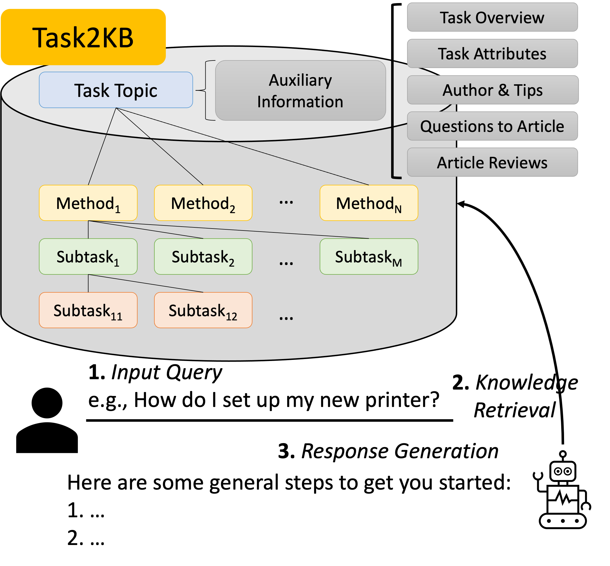
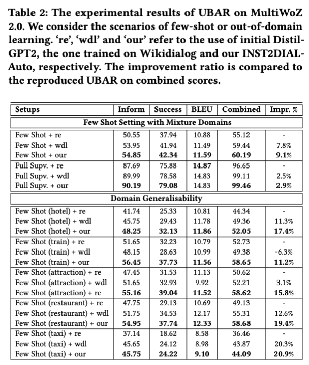
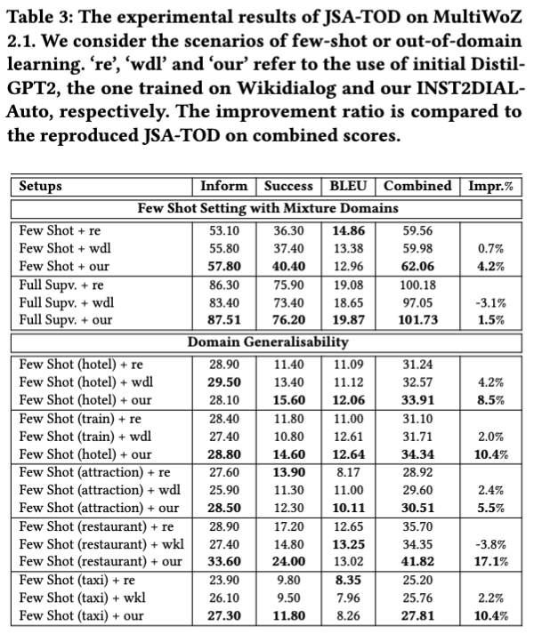

  
  

<h3 align="center">
    
Task-oriented Knowledge Base for developing advanced conversational AI

</h3>

---

   
  
  **Task2KB** is a task-oriented instructional knowledge base, which offers structured instructions and rich types of related information on tasks across **19** categories. Along with rich task-related information, Task2KB also enables accessing the available knowledge via various retrieval techniques (field-based and dense retrievers).  
  Additionally, to illustrate the value of Task2KB, we experimentally augment the knowledge into TOD models with two novel development pipelines: (1) fine-tune LLMs with knowledge from Task2KB for boosting TOD model performance, (2) direct context-augmentation with available knowledge. We observe significant and consistent in advancing the performance of recent TOD models.

---

<h4> Categories of Tasks </h4>

Category (Quantity) | Category (Quantity) | Category (Quantity) 
:-------------------------:|:-------------------------:|:-------------------------:
Arts & Entertainment (13,320) | Car & Other Vehicles (4,925) | Computers & Electronics (24,447)
Education & Communication (24,530) | Family Life (5,383) | Finance & Business (15,305)
Food & Entertaining (9,966) | Health (25,471) | Hobbies & Crafts (22,383)
Holidays & Traditions (2,569)| Home & Garden (24,885) | Pets & Animals (15,087)
Philosophy & Religion (2,872) | Relationship (7,880) | Sports & Fitness (10,094)
Style (18,854)  | Travel (4,826) | Work (11,524)
Youth (7,112) ||

<h3> Indexing Methods for Knowledge Access </h3>
To enable the use of Task2KB, we implment two document indexing methods: field-based indexing and dense indexing:

<h4>Field-based Indexing</h4>
To be filled.

<h4>Dense Indexing</h4> 

The dense indexing and knowledge access are implemented with a joined effort of Facebook [Faiss](https://github.com/facebookresearch/faiss) and Dense Passgae Retrieval ([DPR](https://github.com/facebookresearch/DPR)). To balance the document length and information specificity, we structure each step of task instructions into the following format: 

    id [tab] introduction + step description [tab] Task title
    
Afterwards, we use the `[generate_dense_embeddings.py](https://github.com/facebookresearch/ParlAI/blob/main/parlai/agents/rag/scripts/generate_dense_embeddings.py)' script in [ParlAI](https://parl.ai/docs/index.html) to encode the information and running:

    python generate_dense_embeddings.py -mf zoo:hallucination/multiset_dpr/hf_bert_base.cp --dpr-model True --passages-file step_info_cl.tsv  
    --outfile step_info --num-shards 50 --shard-id 0 -bs 32
    
The `step_info_cl.tsv' file can be obtained via the following [link](https://drive.google.com/file/d/1QUNZ20hnRb_rbSenS12d1cTDW_niVk27/view?usp=share_link).

This repository is about a resource paper, 'Task-Oriented Dialog System with Structured Instructional Knowledge' (under review).

Experimental Results of UBAR & variants         |  Experimental Results of JSATOD & variants
:-------------------------:|:-------------------------:
  |  

In this work, we publicly available two task-oriented conversational datasets joined with a knowledge graph, Task2KB.

The links to access each dataset as well as the knowledge graph are given as follows:

saved_question_generation_model (trained_on_multiwoz):
https://drive.google.com/file/d/1H_dMut5HV72as8zkLV_w07Tz8HkM-OYA/view?usp=share_link

INST2DIAL-Auto:
https://drive.google.com/drive/folders/1ZVPeWrYHRMJ_6MBqGWYuM6eYKJTw3-bC?usp=share_link

INST2DIAL-Manual: 
https://drive.google.com/drive/folders/1hROuwee8BqfPtXkvTo_jmdK7korlntnP?usp=share_link

Task2KB:
https://drive.google.com/drive/folders/1heZ15q5N85EysNLFLlCuPGmLw-Innojk?usp=share_link

The data are presented as per different categories with json format, which allow them to be easy access.

We also public available the code in developing the question generators with T5/Flan-T5 encoder-decoder models, as well as the code
for fine-tuning a response generator based upon the generated datasets.
